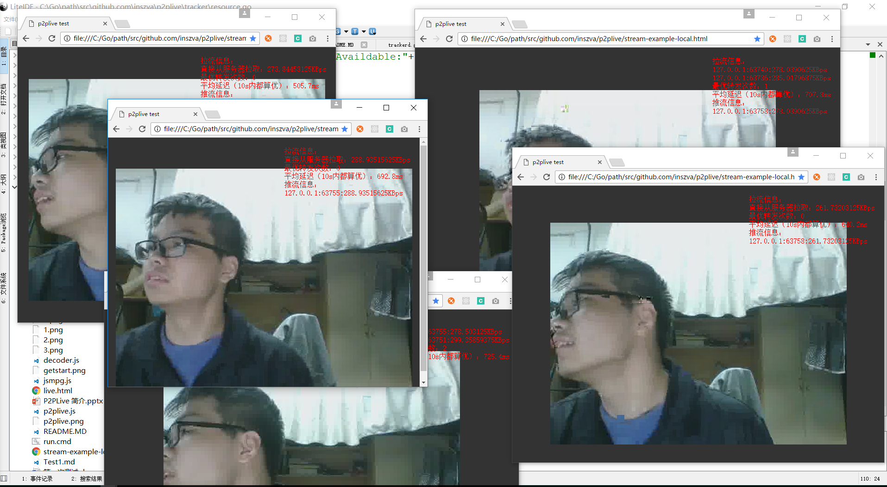
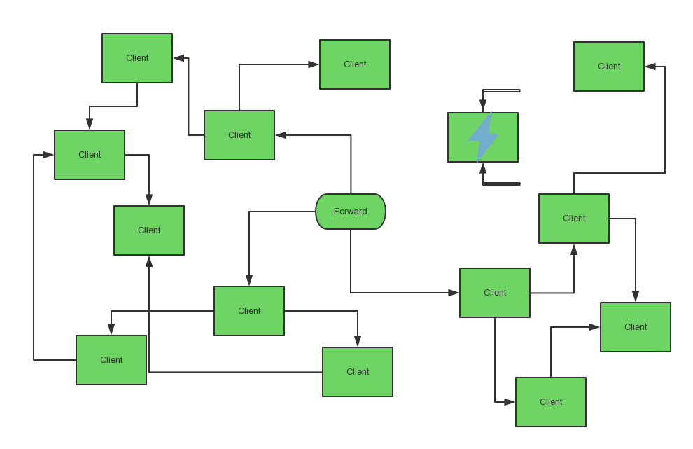
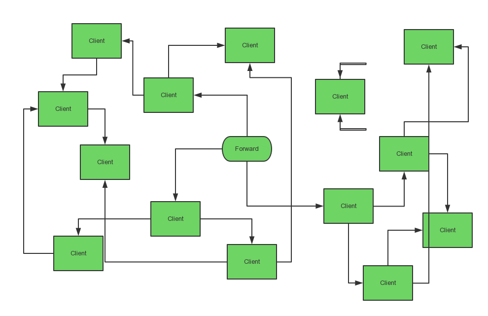

# P2PLive

## Introduction

A project to implements P2P live only use web-browser.

## Destination

To reduce load of many live stream server using Point to Point transport.

## Getting Start

First, you should have installed Go. If you use Ubuntu, you can just run:

```bash
sudo apt-get install go
```

Otherwise, please refer to golang.org.

Then, you can build all the codes in 3 different directories:

```bash
go build ./CoOrdinate
go build ./Tracker
go build ./Forward
```

And you can run `forward`, `coordinate`, `tracker` in order (you can also not in order, but you might wait for sometime for the system get a 
consistence). `forward` listen 9999 port for pushing stream, 9998 port to pulling stream. `coordinate` listen 8080 port, you can request 
`http://127.0.0.1:8080/debug` for the debug infomation. `tracker` listen 9090 port, as well, you can request `http://127.0.0.1:9090/debug` for
 debug infomation.

 And you push stream use the method below (*for windows, osx/linux will be added soon*), then run many `stream-example-local.html`, you can see
  the result.



With the default params in `tracker` and `forward` codes, the first client is pulling stream from `forward` server, but others are pull from clients,
 that is to say, **P2P transfer**. And you can aslo put many `tracker` and `forward` to different severs in different regions, and modify the 
region detect codes in `coordinate` so that you run a big system.

*However, the nat escape has not been implemented(maybe using stun or turn). Comming soon!* 

## Push Stream

ffmpeg -s 640x480 -f vfwcap -i 0 -r 30 -f mpeg1video -vf "crop=iw-mod(iw\,2):ih-mod(ih\,2)" -b 100K -r 30 http://localhost:8080/stream

## Design


### CoOrdinate Server

Client request CoOrdinate Server for a tracker server, server returns a server based on the geographical position of Client and
 other infomation(eg. the client is in a LAN, and there's a tracker server specially for this LAN, eg. Zhejiang University)

The live stream is push to CoOrdinate Server in this version, later vesion will support multi-source live steam. The CoOrdinate Server
 will loop request Trackers to get all forward server and push live stream to them.

### Tracker Server

The Client will be orgnized by the tracker server. The tracker server keep a balance that most client get stream from 2 other client
 and push stream to 2 other client too. If this region of this tracker has less client, tracker tell them to directly pull from the
 forward server so that the forward server's load will be less.

Beginning


A client close


Many transport net break off



Auto fix net



### Forward Server

The Forward Server pull stream from CoOrdinate Server and push to client, keep connection with tracker to help tracker work.

### Client

Client first send http get request to CoOrdinate Server to get a tracker server nearby. Then client request Tracker to get a 
live stream source. The tracker will tell client to get from another 2 clients or forward server directly, also make client to
 push stream to another clients.