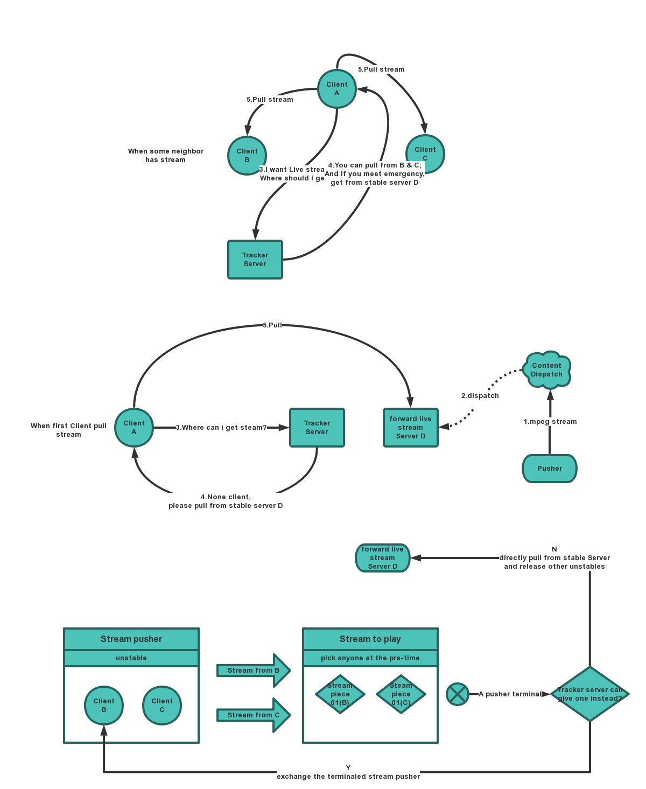

# P2PLive

# Introduction

A project to implements P2P live only use web-browser.

# Push Stream

ffmpeg -s 640x480 -f vfwcap -i 0 -r 30 -f mpeg1video -vf "crop=iw-mod(iw\,2):ih-mod(ih\,2)" -b 3000K -r 30 http://localhost:8082/p2p/640/480/

# Design

